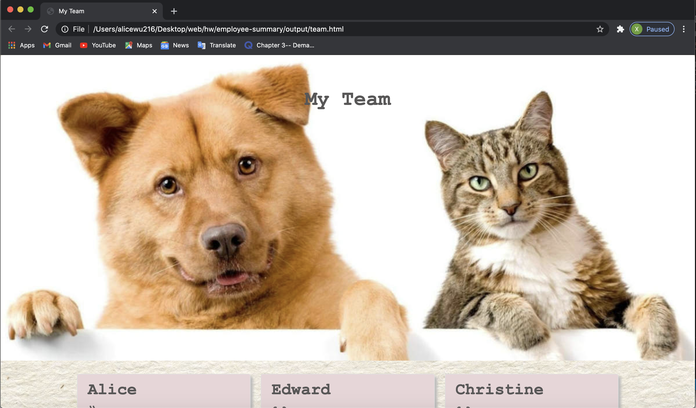
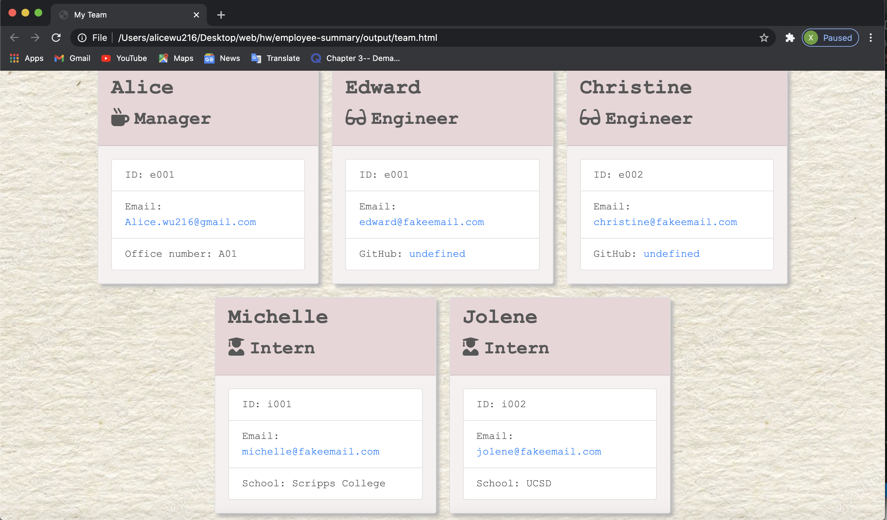

# Employee Summary Generator

<p align="center">
  
  
</p>

[](https://opensource.org/licenses/MIT)

##Table of Contents
* [Description](#description)
* [Installation](#installation)
* [Usage](#usage)
* [Questions](#questions)
* [License](#license)

<br>

## Description
This a a software that generate a team member summary through command line application. This application prompt user for information about the team manager and then information about the team members, whihc can be engineers or interns. This application also contain unit test to ensure successful operation of the constructors and classes in lib folder. When user finished inputing all team member information, a nicely formatted team roster will be writen to an HTML file in the output folder and ready for display in browser.

Please click [here](https://youtu.be/oQFXaWZnW8Q) to check out the application!
<br>

## Installation
Please see the following command in order to use this application:<br>
```bash
npm i  
node app 
```

## Usage
Please see the following instructions on how to use this application: <br>
⭐Download this directory or use "git clone" to clone repository on to your local computer<br>
⭐You need to have Node.js install on the computer beforehand<br>
⭐follow installation instruction in the above section<br>
⭐follow prompt displayed in your terminal<br>
⭐You can add your manager information first and add info for your engineer and interns <br>
⭐HTML file in the new output directory will be writen when you choose you are done adding new members<br>

### Here is a screen shot of how the application should look like



<br>

## Questions?
Feel free to check out my github profile [here](https://github.com/)!
Should you have any questions, you may reach me by e-mail at: alice.wu216@gmail.com

## License
[MIT](https://choosealicense.com/licenses/mit/#)
